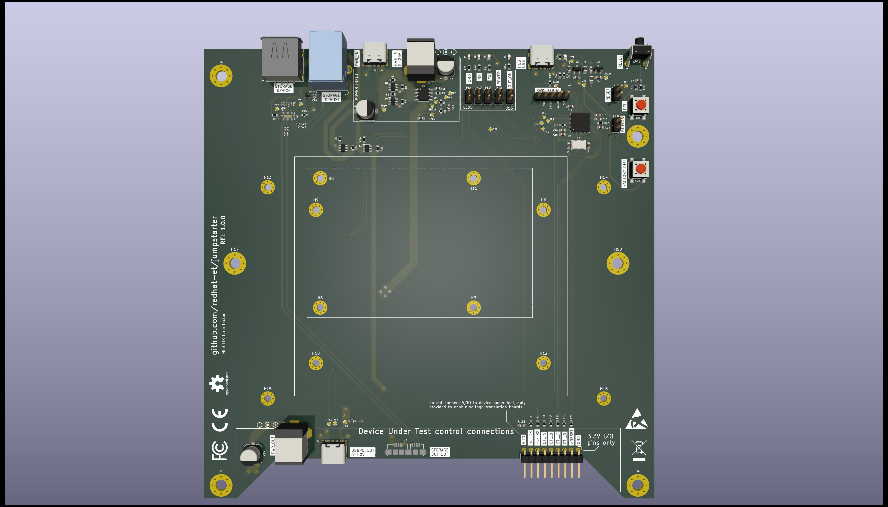
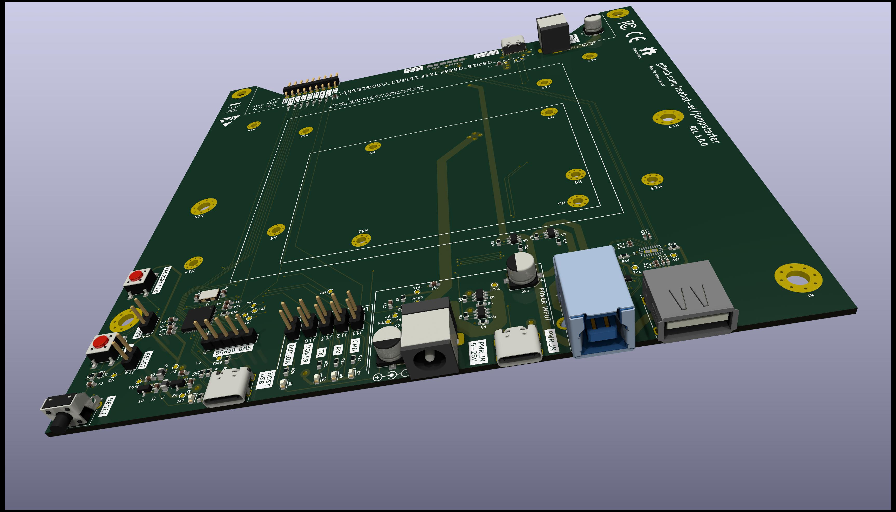
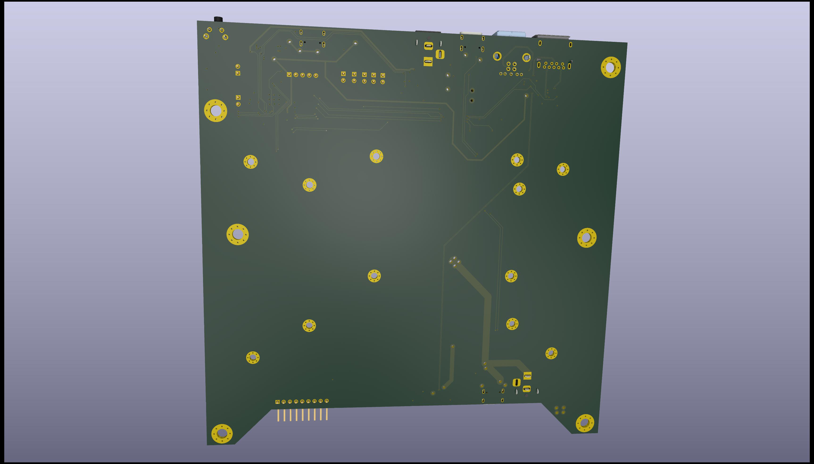

# jumpstarter
jumpstarter is a project designed to enable generic Hardware in the Loop testability for Edge / embedded designs.

# Software Agent

Should enable standard CI tools and pipeline systems (tekton, gitlab, github, Jenkins, etc...) to integrate with the hardware:
 * Load a device image
 * Reboot
 * Gather logs and wait for finish
 * Return results to the CI system
 * Capture power profile during the whole device lifecycle.

# Hardware Agent
One of the components of the project is an Open Hardware board that bridges the Software and Hardware world
of Edge customers. Enabling them to perform Continous Integration of their Hardware and Software.

It's designed to be mounted on 1U 19" Server racks, in the MiniITX format, and should be connected to an
agent that will perform the control loop on the Device Under Test.

## Features

* USB Storage sharing
  * A storage device can be connected to the Testing host, and then passed down to the DUT
  * USB3.1 (up to 10Gbps) capable
  * USB3.0 and 2.0 capable for backwards compatibility
  * Storage device power cycling

* DUT Power management:
  * ON/OFF, Reset, Reboot
  * Measurement and logging in watts (Integration to Kepler)
  * 5-25V power supply support
  * USB-PD power supply support 5-20V with DUT power negotiation
 
* DUT Control (3.3v I/O)
  * UART Serial port TX/RX (for logging and tracing)
  * 4 customizable control signals
  * RESET signal

# Images of release 1.0.0, on prototyping stage

Yes, we are optimistic with versioning!

